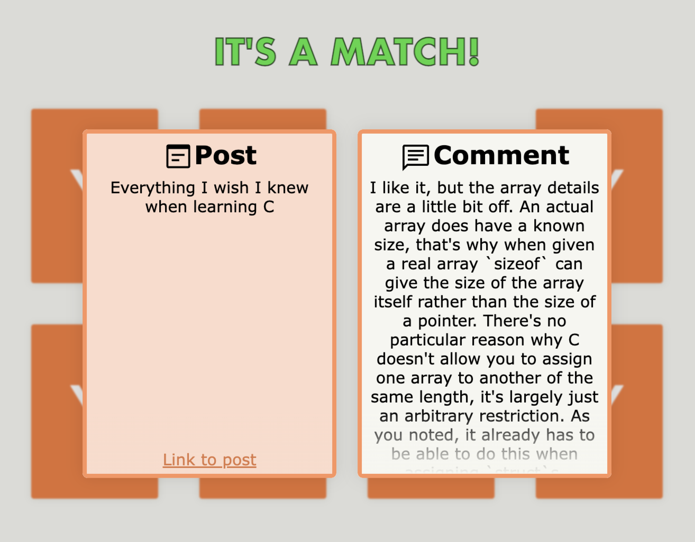

<h1 align="center">HN Matching Pairs</h1>

<b>A game where you match Hacker News comments to posts</b>

<a href="https://hn-matching-pairs.web.app">Play game</a>

# Gameplay

The game consists of 16 cards (8 posts and 8 comments). It's your job to find out which comment was written for which post.

The data for the game is fetched live from [Hacker News](https://news.ycombinator.com/). It uses the 8 top posts and their corresponding top comment. 

# UI

To look at a card, you click it. When you're done looking, you can click anywhere to close the card. The card you clicked is now your selected card (marked by a black border). The next card you click will be compared to your selected card.

A common mistake is to click on the card you want to compare with - before you close the first selected card. You can't do this because a flipped card is big enough to almost cover cards next to it, making those cards hard to click.

# Motivation

I made this mainly because I thought it would be fun to play (I see it as a Wordle alternative for Hacker News addicts). 

I also saw this as a chance to get more comfortable with [SolidJS](https://www.solidjs.com/) and complex animations.

# License

This project is licensed under the MIT License - see the [LICENSE](LICENSE) file for details.
